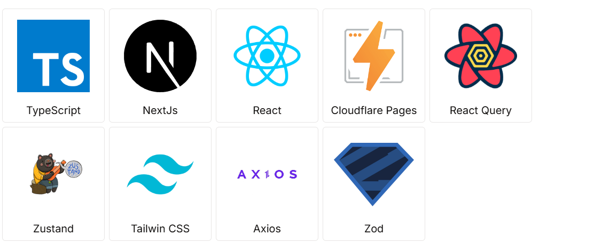

# DeepTodo <!-- omit from toc -->

많은 Kanban 보드와 Todo 앱이 존재합니다. 하지만 완료된 목록 확인 불편과 하위 할일을 한번에 확인하지 못하다는 문제점이 있습니다.

**DeepTodo** 앱은 이러한 문제점을 해결한 앱입니다.

Kanban 보드와 Todo 리스트의 결합으로 Kanban 보드로 일정을 관리할 수 있으며 할일을 작성시 **무한히 중첩되는 하위 할일**이 작성이 가능해서 전체적인 진행 상황을 한번에 확인이 가능합니다.

- 개인 프로젝트

## 기간

- `2024-07-15` ~ `2024-08-15`
  - 백엔드: 10일
  - 프론트: 20일

## 링크

- `client`: https://deeptodo.secondphantom.com/
- `api`: https://deeptodoapi.secondphantom.com/
- `docs`: https://deeptodoapi.secondphantom.com/docs/index.html

## 기술스택

### 백엔드


### 인프라


### 프론트



## 목차 <!-- omit from toc -->

- [기간](#기간)
- [링크](#링크)
- [기술스택](#기술스택)
	- [백엔드](#백엔드)
	- [인프라](#인프라)
	- [프론트](#프론트)
- [아키텍쳐](#아키텍쳐)
	- [인프라](#인프라-1)
	- [CI / CD](#ci--cd)
- [ERD](#erd)
- [기능](#기능)
- [DB 설계](#db-설계)
	- [복합 인덱스를 통한 조회 성능 향상](#복합-인덱스를-통한-조회-성능-향상)
	- [Project JSONB 필드 활용 역정규화 및 최적화](#project-jsonb-필드-활용-역정규화-및-최적화)
- [Spring Data JPA 최적화](#spring-data-jpa-최적화)
	- [SELECT 최적화](#select-최적화)
	- [UPDATE 최적화](#update-최적화)
- [비지니스 로직](#비지니스-로직)
	- [Project 동기화 충돌](#project-동기화-충돌)
- [프로젝트](#프로젝트)
	- [테스트 코드 작성](#테스트-코드-작성)

## 아키텍쳐

### 인프라


### CI / CD


- jenkins, ansible, ngnix, docker를 활용한 무중단 배포 구현

## ERD


## 기능

- 인증
  - 소셜 회원가입 / 로그인
- 계정
  - 탈퇴
  - 로그 아웃
  - 업데이트 프로필
- 프로젝트 목록
  - 검색, 정렬
- 프로젝트
  - 생성, 삭제, 업데이트

|                      메인                      |                 소셜 회원가입                 |
| :--------------------------------------------: | :--------------------------------------------: |
|  |  |
|                  소셜 로그인                  |                 프로젝트 생성                 |
|  |  |
|              프로젝트 리스트 쿼리              |                 프로젝트 작성                 |
|  |  |
|                     프로필                     |                      플랜                      |
|  |  |

## DB 설계

### 복합 인덱스를 통한 조회 성능 향상

#### 문제점

- project는 유저에 종속되며 다른 유저가 볼수 없는 특징을 가짐
- 그렇기에 project list query를 할때 where 절에  `user_id`는 필수적으로 적용됨
- project list를 query할때 최신 목록 순으로 정리되어야함
- `update_at`에만 index를 설정하면 전체 테이블에 대한 index이므로 query를 할때 where절 `user_id` 조건으로 order query하게 되면 index가 사용되지 않음

#### 개선

- `user_id`와 `update_at` 순서로 복합 인덱스설정을 통한 성능 향상

#### 테스트

- 환경
  - 2만 Rows
- query
  - `SELECT id, title, user_id, updated_at FROM public.projects WHERE user_id = 'id' ORDER BY updated_at DESC LIMIT 10;`

##### 결과

- 2배 빠르게 쿼리 수행

| index                        | Execution Time |
| ---------------------------- | -------------- |
| `user_id`, `updated_at`  | 0.072 ms       |
| `user_id` & `updated_at` | 0.035 ms      |

##### Query Plan

###### `user_id`, `updated_at`


###### `user_id` & `updated_at`


### Project JSONB 필드 활용 역정규화 및 최적화

#### 문제점

- table row 증가
  - project에는 하위에는 여러 board와 그리고 그 board 하위에 여러 todo로 구성되어 있음
  - `projects`에 1대 M로 `boards` 와 `todos` 테이블 구성하게 되면 많은 양의 row가 필요하게되어 성능상 문제가 발생
- json으로 list로 역정규화 문제점
  - `boards`와 `todos` 자주 변경이 되고 삭제되어야함
  - postgresql jsonb 데이터로 list로 값의 삭제와 삽입은 어려움이 존재함
    - 예를 들어 list에 postgerql에 insert를 하나만 할경우 문제가 발생하지 않지만 많은 수의 insert하고 insert index 위치가 다른 경우 insert할대 마다 db의 index가 변경되기 때문에 insert 문제가 발생
    - 여러 index에 위치에 동시에 insert하기 어려움

#### 해결

- `boards`와 `todos`를 key value 쌍으로 변경하고 board에 순서는 `root`에 저장 todo의 순서의 `boards`의 `tress`에 저장하도록 스키마 변경
  - 값이 변경된 key 값을 찾아서 value를 변경이 가능함
  - 1:1 관계에서 update를 하는것이기 때문에 속도가 빠름
  - 동시에 여러개 값을 삭제 및 업데이트 가능

#### 테스트

- 환경
  - 2만 Rows

##### 결과

- 약 2배 빠르게 쿼리 수행

| jsonb  | Execution Time |
| ------ | -------------- |
| Array  | 0.150 ms       |
| Object | 0.077 ms       |

- 일부 변경 업데이트의 쿼리 단순화

```sql
UPDATE
    projects 
SET
    version = ?,
    title = ?,
    root = CAST(? AS jsonb),
    boards = boards - ? || CAST(? AS jsonb),
    todos = todos - ? - ? || CAST(? AS jsonb),
    updated_at = ? 
WHERE
    id = ? 
    AND user_id = ?;
```

##### Explain

`JSONB Array`


`JSONB KeyValue`


##### 스키마 변경 내용

`Old`

```json
{
  "projectId": 1,
  "boards": [
    {
      "title": "Board 1",
      "id": "board-1",
      "todos": [
        {
          "title": "Todo 1",
          "id": "todo-1"
        },
        {
          "title": "Todo 2",
          "id": "todo-2"
        }
      ]
    },
    {
      "title": "Board 2",
      "id": "board-2",
      "todos": [
        {
          "title": "Todo 3",
          "id": "todo-3"
        },
        {
          "title": "Todo 4",
          "id": "todo-4"
        }
      ]
    }
  ]
}

```

`New`

```json
{
  "projectId": 1,
  "root": ["board-1", "board-2"],
  "boards": {
    "board-1": {
      "title": "Board 1",
      "id": "board-1",
      "trees": ["todo-1", "todo-2"]
    },
    "board-2": {
      "title": "Board 2",
      "id": "board-2",
      "trees": ["todo-3", "todo-4"]
    }
  },
  "todos": {
    "todo-1": {
      "title": "Todo 1",
      "id": "todo-1"
    },
    "todo-2": {
      "title": "Todo 2",
      "id": "todo-2"
    },
    "todo-3": {
      "title": "Todo 3",
      "id": "todo-3"
    },
    "todo-4": {
      "title": "Todo 4",
      "id": "todo-4"
    }
  }
}

```

## Spring Data JPA 최적화

### SELECT 최적화

#### 문제점

- project 테이블의 row 값은 다른 테이블 대비 row당 큰 값을 저장 되도록 설계 되어 있음
- Spring Data JPA 기본으로 제공하는 method로 검색을 할때 row 전체를 조회하는게 기본이기 때문에 불필요한 값까지 조회되는 `over fetching`이 발생함
  - 큰 값을 저장되어 있는 row인 경우 성능상 문제가 발생

#### 해결법

- QueryDsl Projection을 사용하여 select 최적화

```java
public List<QueryProjectDto> findProjectsByQuery(GetProjectsByQueryDto dto, Long userId) {
		BooleanExpression searchPredicate = createSearchPredicate(dto.search());
		BooleanExpression enabledPredicate = createEnabledPredicate(dto.enabled());
		OrderSpecifier<?> orderSpecifier = createOrderSpecifier(dto.order());

		return queryFactory.select(
			Projections.constructor(
				QueryProjectDto.class,
				project.id,
				project.title,
				project.enabled,
				project.createdAt,
				project.updatedAt
			))
			.from(project)
			.where(searchPredicate, enabledPredicate,project.user.id.eq(userId))
			.orderBy(orderSpecifier)
			.offset((dto.page() - 1) * PAGE_SIZE)
			.limit(PAGE_SIZE)
			.fetch();
}
}
```

### UPDATE 최적화

#### 문제점

- Spring Data JPA에서 영속성 컨테스트에서 일부 값을 업데이트를 하기위해서는 먼저 조회가 필요함
- Project 테이블은 비교적 큰 값이 들어가기 때문에 전체를 전체 하나의 Row를 조회시 성능상 문제가 발생할 수 있음
- 일반 sql 문으로 작성했을 때는 `pk`와 변경된 값만으로 업데이트가 가능함
- Project 테이블의 일부 업데이트는 JSONB 값을 포함하기 Spring Data Jpa의 @Query 어노테이션 만으로 어려움이 있음

#### 해결

- NativeQuery를 사용하여 직접 코드를 작성하여 영속성 컨텍스트를 거치지 않고 바로 쿼리 가능하도록 하여 업데이트 최적화

```java
public void partialUpdateByIdAndUserId(
            PartialUpdateProjectByIdAndUserIdDto dto
    ) throws JsonProcessingException {

        List<String> setStrList = new ArrayList<>();
        List<KeyWithParam> keyWithparamList = new ArrayList<>();

        if (dto.version() != null) {
            setStrList.add("version = :version");
            keyWithparamList.add(
                    new KeyWithParam("version", dto.version())
            );
        }

        if (dto.title() != null) {
            setStrList.add("title = :title");
            keyWithparamList.add(
                    new KeyWithParam("title", dto.title())
            );
        }

        if (dto.root() != null) {
            setStrList.add("root = cast(:root as jsonb)");
            String rootJson = objectMapper.writeValueAsString(dto.root());
            keyWithparamList.add(
                    new KeyWithParam("root", rootJson)
            );
        }

        if (dto.boards() != null) {
            StringBuilder queryStr = new StringBuilder("boards = boards");

            List<String> nullKeys = dto.boards().entrySet().stream()
                    .filter(entry -> entry.getValue() == null)
                    .map(Map.Entry::getKey)
                    .toList();
            Map<String, Board> notNullMap = dto.boards().entrySet().stream()
                    .filter(entry -> entry.getValue() != null)
                    .collect(Collectors.toMap(Map.Entry::getKey, Map.Entry::getValue));
            if (!nullKeys.isEmpty()) {
                for (String key : nullKeys) {
                    queryStr.append(" - :").append(key);
                    keyWithparamList.add(
                            new KeyWithParam(key, key)
                    );
                }
            }
            if (!notNullMap.isEmpty()) {
                String updateBoardJson = objectMapper.writeValueAsString(notNullMap);
                queryStr.append(" || cast(:updateBoardJson as jsonb)");
                keyWithparamList.add(
                        new KeyWithParam("updateBoardJson", updateBoardJson)
                );
            }
            setStrList.add((queryStr.toString()));
        }

        if (dto.todos() != null) {
            StringBuilder queryStr = new StringBuilder("todos = todos");

            List<String> nullKeys = dto.todos().entrySet().stream()
                    .filter(entry -> entry.getValue() == null)
                    .map(Map.Entry::getKey)
                    .toList();
            Map<String, Todo> notNullMap = dto.todos().entrySet().stream()
                    .filter(entry -> entry.getValue() != null)
                    .collect(Collectors.toMap(Map.Entry::getKey, Map.Entry::getValue));
            if (!nullKeys.isEmpty()) {
                for (String key : nullKeys) {
                    queryStr.append(" - :").append(key);
                    keyWithparamList.add(
                            new KeyWithParam(key, key)
                    );
                }
            }
            if (!notNullMap.isEmpty()) {
                String updateTodoJson = objectMapper.writeValueAsString(notNullMap);
                queryStr.append(" || cast(:updateTodoJson as jsonb)");
                keyWithparamList.add(
                        new KeyWithParam("updateTodoJson", updateTodoJson)
                );
            }
            setStrList.add((queryStr.toString()));
        }

        boolean isNeedUpdate = setStrList.size() >= 2;
        if (!isNeedUpdate) {
            return;
        }

        LocalDateTime updatedAt = LocalDateTime.now();
        setStrList.add("updated_at = :updatedAt");
        keyWithparamList.add(
                new KeyWithParam("updatedAt", updatedAt)
        );
        String updateStr = "UPDATE projects ";
        String whereStr = " WHERE id = :projectId AND user_id = :userId";
        keyWithparamList.add(
                new KeyWithParam("projectId", dto.projectId())
        );
        keyWithparamList.add(
                new KeyWithParam("userId", dto.userId())
        );


        Query query = em.createNativeQuery(updateStr +
                "SET " + String.join(", ", setStrList) +
                whereStr
        );
        keyWithparamList.forEach(keyWithParam -> query.setParameter(keyWithParam.key, keyWithParam.value));


        query.executeUpdate();

    }
```

## 비지니스 로직

### Project 동기화 충돌

#### 문제점

- 하나의 문서를 여러 디바이스에서 저장을 하게되면 동기화 되기 전에 저장을 할경우 최신 문서가 예전 문서로 덮어 씌어지는 문제가 발생함 (동기화 충돌)

#### 해결

- 문서에 version field를 추가하여 저장 할 때마다 값을 증가시켜  `버전 관리`를 통해 최신 문서임을 확인하는 로직을 추가했습니다.
- 사용자가 문서를 저장하거나 또는 동기화 확인을 할때 Alert 발생하여 사용자가 현재 파일을 저장할지 최신 버전을 불러올지 선택 가능하도록 전략을 작성 (사용자 선택 우선)

##### 다이어그램


## 프로젝트

### 테스트 코드 작성

- 주요 클래스 테스트 커버리지 80% 이상 달성

#### 작성 방향

- Service 클래스
  - 의존하는 클래스에 대한 Mocking을하지 않고 테스트 코드 작성
  - service 레이어서 exception 로직을 작성했기에 `success`와 exceptions에 따른 `fail` 사례 test 코드 작성
- Repository 클래스
  - `Native Query`와 `QueryDsl`을 사용하는 코드가 있기 때문에 그와 관련된 테스트 코드 작성
- Controller 클래스
  - 의존하는 클래스는 Mocking을 하여 진행하고 요청값과 응답값에 중점으로 테스트 코드 작성

#### jacoco report


